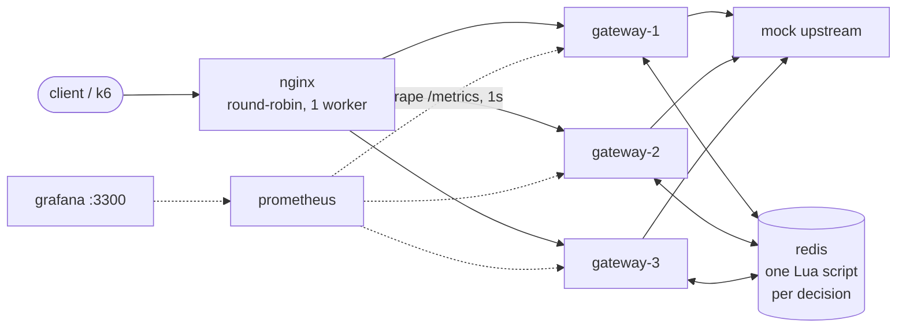

# turnike

**turnike** — a turnstile for your APIs. A distributed rate limiter & API
gateway in Go, stdlib-first, with hand-implemented fixed window, sliding
window and token bucket algorithms, atomic shared state via Redis+Lua,
and measured — not asserted — behavior: the multi-replica bypass, the
burst-admission semantics of all three algorithms and the latency under
load are all recorded runs in [`bench/`](bench/REPORT.md).

## The problem

APIs get rate-limited at the edge for three reasons: fairness between
clients, abuse containment, and protecting upstream capacity that is
finite whether you admit it or not. A rate limiter is a small thing —
a counter and a clock — right until the gateway in front of the API
stops being one process.

Scale the gateway horizontally and every naive implementation breaks
the same way: each replica counts in its own memory, so N replicas
enforce N quotas that happen to share a config file. This repo measures
that failure instead of asserting it. Three gateway replicas behind
round-robin nginx, one identity, 150 sequential requests against a
limit of 30 (`make demo`; the only difference between the two runs is
the `limiter` block of the gateway config):

| `limiter.backend` | quota | requests | admitted (200) | denied (429) |
|---|---:|---:|---:|---:|
| `memory` | 30 | 150 | **90** | 60 |
| `redis` | 30 | 150 | **30** | 120 |

With per-instance memory the mechanism admits up to replicas × rate;
the measured run hit that bound exactly — round-robin split the
requests 50/50/50 and each replica granted its own 30, visible in the
raw output as `x-ratelimit-remaining` counting down in three
interleaved sequences (29, 29, 29, 28, 28, 28, …). With redis, request
30 was the last one through (`remaining=0`) and request 31 got 429.
Raw outputs: [`bench/demo_bypass_memory.txt`](bench/demo_bypass_memory.txt),
[`bench/demo_bypass_redis.txt`](bench/demo_bypass_redis.txt); tables
and notes in [`bench/REPORT.md`](bench/REPORT.md).

So the goals, in order: **exact quotas across instances** (one shared
counter, atomically updated — not N approximate ones); **bounded
failure modes** (redis going down must mean something you chose, not
something that happens to you); **operability** (metrics that answer
"whose verdict was this" during an outage). Non-goals: authentication
(identity is a header), multi-region, and anything a web framework
would bring — the gateway is `net/http` + `httputil.ReverseProxy`.

## Architecture

The demo topology (`docker-compose.demo.yml`) is the deployment story
in miniature — every box below is a container in the compose file:



A request travels: reserved paths first (`/healthz`, `/readyz`,
`/metrics` are answered ahead of the route table, outside the access
log and the quota) → route match → identity → rate-limit decision →
headers → proxy.

**Routing** is segment-boundary longest-prefix over the route table in
[config.example.yaml](config.example.yaml): a prefix matches whole
path segments only, so `/api` matches `/api` and `/api/users` but not
`/apiv2`, and `/api/v1` never captures `/api/v1beta/x`. When several
prefixes match, the longest wins. The URL is forwarded unchanged (no
prefix stripping); paths with dot segments (plain or percent-encoded)
are rejected outright so the matched route and the upstream's resolved
path cannot diverge.

**Identity** is the `X-API-Key` header, falling back to the client IP —
`X-Forwarded-For` is deliberately not trusted, since it is
client-controlled and would let anyone mint fresh identities. This
assumes turnike runs at the edge: behind another load balancer every
client collapses to that balancer's address (a `trusted_proxies` knob
is the natural follow-up if that setup is ever needed). The raw key
never appears in logs or redis — only a fingerprint. Every proxied
request gets an `X-Request-Id` and one structured access-log line.

**Every matched response** carries `X-RateLimit-Limit` / `-Remaining` /
`-Reset`; a denial is a `429` with `Retry-After` (ceil'd — never advise
less wait than actual). The gateway sets these before proxying and owns
the names.

**Backends.** All three algorithms run behind one `Limiter` interface
with two implementations. `memory` keeps one bucket per (route,
identity), capped at 100,000 entries — identity is unauthenticated
client input, so nothing but that cap stops a caller from growing the
map by varying `X-API-Key`; past the cap a brand-new identity fails
open rather than being tracked. `redis` replaces the map with TTL'd
keys that age out on their own — the structural fix for what the cap
patches — and makes the counters shared, which is the point of this
repo.

### Observability

Every gateway serves Prometheus metrics on `/metrics` — a reserved
path, so a scrape is never proxied, rate-limited, logged or
self-counted. The registry holds exactly four families and no runtime
collectors — more would be noise:

| metric | type | labels | meaning |
|---|---|---|---|
| `turnike_requests_total` | counter | `route`, `decision` | requests that reached the rate-limit decision point |
| `turnike_request_duration_seconds` | histogram | — | gateway answer duration, all outcomes (allowed answers include upstream time) |
| `turnike_breaker_state` | gauge | — | circuit breaker: 0 closed, 1 open, 2 half-open; constant 0 under the memory backend |
| `turnike_limiter_backend` | gauge | `backend` | one-hot: 1 for the backend that answered the most recent decision |

The `decision` label answers *whose verdict was this*: `allow`/`deny`
are the configured backend's own quota verdict; `degrade_allow` /
`degrade_deny` are the in-memory fallback's verdict while redis is
unreachable — kept apart so an outage doesn't erase the 429 rate from
the graphs; bare `degrade` means no verdict existed at all (the
`fail_open` pass-through or the `fail_closed` 503).

What is deliberately **not** a label: the client key. Identity is
unauthenticated client input — the same reason the memory limiter caps
its state map — so labeling by key would let any caller mint one time
series per header value and grow the TSDB without bound. The `route`
label comes only from the static route table; 404s are not counted at
all, so scanner noise mints nothing either.

The demo compose carries prometheus (1s scrape) and grafana with a
provisioned datasource and dashboard — the JSON in git *is* the panel
set, anonymous on <http://localhost:3300>, no click-here instructions.
The degrade drill it exists for is in the [runbook](#running-it).

## The three hardest calls

### 1. One Lua script per decision — not GET-then-SET

A rate-limit decision is a read-check-write. Done as separate
commands, two gateways interleave: at rate 10 with the count at 9, A
reads 9, B reads 9, both conclude "under limit", both write — 11
admitted. Every non-atomic implementation has this window, and adding
instances widens it. turnike runs the whole check-and-consume as **one
Lua script per decision**: redis executes scripts serially, so the
read, the verdict and the write are one atomic step — and one round
trip. A hammer test per algorithm drives 4 clients × 100 goroutines at
one key and asserts *exactly* its quota admitted.

**One clock: redis TIME.** The scripts take time from
`redis.call('TIME')`, in integer microseconds. No gateway clock
participates in any decision, so instances need not agree on wall
time — a drifting replica cannot stretch or shrink anyone's window.
Redis 7 replicates scripts by effects, which is what makes writing
after the non-deterministic TIME call legal. Two footnotes, both
benign and both documented in the script headers: the fixed_window
grid anchors at the Unix epoch (the in-memory backend anchors at Go's
zero time — the backends never share state), and because TIME is
gettimeofday, not monotonic, fixed_window keeps its stored window when
TIME steps backward instead of handing out a fresh quota.

**EVALSHA and restarts.** Scripts are addressed by SHA-1. Whenever the
script cache is empty — first boot, a redis restart, a `SCRIPT FLUSH` —
the client falls back to `EVAL`, which executes *and re-caches* the
script, so limiting self-heals on the very next decision; an
integration test flushes the cache mid-run and asserts exactly `rate`
admissions across the flush. Boot additionally does a best-effort
`SCRIPT LOAD`, surfacing Lua syntax errors immediately instead of on
the first request.

**Every key expires.** Identity is unauthenticated client input, so
keys must age out on their own — the structural fix for what the
in-memory backend's 100k cap patches. Each algorithm's state carries
the tightest TTL that cannot cut a live window short (see the table in
the next section). sliding_window also trims expired members before
every decision, and its members carry a per-call nonce: TIME has µs
resolution, so two same-µs accepts are real and must not collapse into
one zset entry.

### 2. Three algorithms — trade-offs measured, not recited

Textbooks list the trade-offs; this repo put numbers on them. Two
recorded k6 experiments against the demo topology (nginx → 3 replicas
→ one redis), full tables and raw files in
[`bench/REPORT.md`](bench/REPORT.md):

**The same 6-second spike, the same quota (50 per 10s), three
different answers** — the burst runs fire ~1800 requests (300 rps for
6s) timed by redis TIME to straddle a fixed_window grid boundary:

| algorithm | admitted | why |
|---|---:|---|
| fixed_window | **100** | the spike straddles a window boundary: the full 50 on each side — the classic 2× edge, measured |
| sliding_window | **50** | a timestamp log has no boundary to exploit: exactly the quota, ever |
| token_bucket | **79** | the full burst (50) up front, then ~6s of continuous refill at 5/s (≈80 ideal) |

| algorithm | state in redis | TTL |
|---|---|---|
| fixed_window | hash `{ws, count}` | window end |
| token_bucket | hash `{tokens, last_us}` | time to refill to full (full ≡ fresh key) |
| sliding_window | zset of accept times | one window |

**What a decision costs** — sustained 200 rps for 60s per algorithm
(~12,000 requests, zero denials), quota far above arrival so the
percentiles measure the pure allow path. The clean signal is the
median: the gateway's own label-less histogram sits at (0.5, 1] ms for
all three algorithms on redis and (0, 0.5] ms on memory, so the
redis-vs-memory delta at the median — read from that same histogram so
the upstream time cancels out — is about 0.3 ms, the price of one
shared-state round trip. The tails move run to run (gateway-side p95 a
few ms, p99 anywhere from ~5 to ~25 ms across the redis runs, no
algorithm consistently worst; k6's client-side p99 ranges wider still,
to ~48 ms); on a single-VM laptop rig they measure scheduling noise
more than algorithm structure, so REPORT.md keeps them as bucket bounds
rather than pretending to a stable p99. Numbers are for
relative comparison on this rig; absolute capacity claims are exactly
what they would be worth. One structural note the small-N runs
deliberately don't exercise: sliding_window's log holds one member per
admitted request per window (~200 here), so its per-decision cost and
redis memory grow with rate × window where fixed_window and
token_bucket stay O(1) — a real cost this rig is too small to make
visible, not a measured penalty.

**Choosing:** billing or enforcement semantics want `sliding_window`
(exact, no boundary artifacts) or `fixed_window` when the grid is
acceptable and cheapness matters; user-facing APIs that should absorb
honest spikes want `token_bucket` and a burst sized to the spike you
mean to forgive. `key_overrides` swaps limits (or the whole algorithm)
per API key.

### 3. When redis is down: choose your failure, don't discover it

Every redis call runs through a small circuit breaker — 5 consecutive
failures open it, one probe per 1s cooldown decides recovery — so an
outage costs each instance roughly one probing call per cooldown, not
one failed call per request. The `on_error` policy says what an
unanswerable decision means:

| `on_error` | requests | rate-limit headers | `/readyz` | over-admission while down |
|---|---|---|---|---|
| `fail_open` | proxied, unlimited | none | 200 | unbounded |
| `fail_closed` | 503 + `Retry-After` | none | **503** | zero |
| `degrade` (default) | limited per instance, in memory | real, instance-local | 200 | ≤ instances × limit |

`degrade` falls back to the same in-memory limiter the memory backend
uses, so the upstream stays approximately protected *and* available;
recovery can double-count briefly (bounded by one window) when redis
state expired during the outage. `fail_closed` is for enforcement
semantics (quotas, billing): nothing may slip through, at the price of
turning a redis outage into a request outage. It is also the only
policy whose redis ping gates `/readyz` — and that asymmetry is the
actual decision here. Redis is a *shared* dependency: if every
instance readiness-failed the moment redis blinked, the load balancer
would drain the whole pool at once, manufacturing the very outage
`fail_open` and `degrade` exist to survive. Under those two policies
the instance is still doing useful work, so it stays ready and the
breaker gauge carries the bad news instead. One accepted edge: under
fail_closed a fresh PONG can advertise an instance up to one cooldown
before the breaker's next probe closes the circuit.

The dashboard makes the whole story watchable live — the
[runbook](#running-it) has the 60-second drill: stop redis, watch
every replica's decisions flip to `degrade_*`, breakers flip open, the
latency panel spike toward the 1s client timeout and then collapse
once the circuits are open. That spike is the breaker earning its
keep.

## What changes at 10x

Not built — this is what I would change, and what each change costs.
The numbers this section leans on are the measured ones in
[`bench/REPORT.md`](bench/REPORT.md); it deliberately contains none of
its own.

- **The ceiling is one redis.** Every decision is one round trip
  through one node executing scripts serially — that is where the
  exactness comes from, and it is also the scaling limit (per-decision
  cost on this rig: see the report). The design already has the
  property a shard-out needs: every script touches exactly one key
  (`turnike:{algo}:{route}:{identity}`), so decisions for different
  keys are independent and shard cleanly by key — consistent hashing
  across nodes, or redis cluster, whose slot mechanics single-key
  scripts are already compatible with. What sharding does *not* need
  is any change to the atomicity story: each key's read-check-write
  stays on one node.
- **Hot keys don't shard.** One celebrity API key still lands every
  decision on one node. The honest fix trades exactness back: lease
  token batches to gateways (a gateway takes 100 tokens in one round
  trip, burns them locally, returns for more) — over-admission becomes
  bounded by outstanding leases instead of zero, which is the same
  shape of bound the degrade fallback already accepts during outages.
  At 10x you choose per route: exact-and-shared where money is
  counted, leased-and-cheap where it isn't.
- **Degrade's bound grows with the fleet.** Instance-local fallback
  over-admits ≤ instances × limit; at 3 replicas that is a footnote,
  at 30 it is 30× and the policy needs re-sizing (smaller fallback
  quotas, or fail_closed on the routes that cannot tolerate it). The
  failure policy is per-deployment configuration today precisely so
  this stays a config decision, not a rewrite.
- **The admin plane splits off.** `/metrics` on the data-plane port
  (and the demo LB forwarding it) is a documented demo simplification;
  production binds a separate admin listener the load balancer never
  routes, and readiness/scrape traffic stops sharing a port with
  clients.
- **Observability keeps its cardinality discipline.** The
  identity-is-never-a-label rule is what makes 10x scrape volume a
  budget question rather than a TSDB incident; per-instance series
  multiply by fleet size, per-client series would multiply by the
  world.

## Running it

**Quickstart** (Go 1.26+):

```sh
make build                 # gateway + mock upstream binaries
make run                   # gateway on :8080 with config.example.yaml
make test                  # unit tests, -race
make test-integration      # + redis hammers against the dev compose (REDIS_ADDR-gated)
```

**The 60-second bypass demo** — the measured table at the top of this
README, reproduced end to end (docker compose v2 + curl ≥ 7.83):

```sh
make demo
```

builds the demo images, stands up nginx → 3 replicas → one redis,
drives 150 requests through each arm (`backend: memory`, then
`backend: redis`), asserts the run's invariants (fresh counters, 3
distinct upstreams, exact line counts — a failed assertion marks the
output `RUN INVALID` rather than publishing it) and writes the raw
per-request logs to `bench/demo_bypass_*.txt`. Expect ~a minute; the
script waits out fixed_window's top-of-the-hour rollover if one is
imminent, on redis's own clock.

**The degrade drill** — the observability story, live:

```sh
DEMO_BACKEND=degrade docker compose -f docker-compose.demo.yml up -d --build --wait
while :; do seq 1 100 | xargs -P 8 -I{} curl -so /dev/null -H 'X-API-Key: demo-key' localhost:8090/demo/hello; done
```

then open <http://localhost:3300> and, in a second terminal,
`docker compose -f docker-compose.demo.yml stop redis` / `start redis`.
The concurrency matters: a sequential curl loop tops out below the
replicas' aggregate fallback quota and the degraded deny band would
never appear; eight parallel curls exceed both the shared 2/s quota
(healthy: a solid `deny` band) and the replicas × 2/s fallback
aggregate (degraded: a solid `degrade_deny` band). Expect the first
seconds after the stop to crawl — until each replica's breaker trips,
every decision burns the 1s redis client timeout; the latency panel
spikes toward 1s, then the open circuits make the fallback instant.

**The load runs** — the numbers behind the measured claims above:

```sh
make load
```

drives the 9-run k6 matrix (3 algorithms × sustained on both backends,
plus 3 burst-semantics runs) against the demo topology with a pinned
k6 container joined to the compose network, and writes every raw
output to `bench/load/`. Each run's assertions gate publication the
same way the bypass demo's do. ~15 minutes on a laptop.

**Scope notes.** Single redis node by design (`addr`, not a cluster
client) — the Lua scripts are single-key and therefore
cluster-slot-compatible, but clustering is untested here and out of
scope (see [10x](#what-changes-at-10x)). Serving `/metrics` on the
data-plane port is a demo simplification; production binds a separate
admin listener.

## License

[MIT](LICENSE)
